https://chatgpt.com/share/6a10d4fc-e688-83eb-bd08-68e21dab1461

Below is a comprehensive guide. I structured it like a mini-course for your drug-synergy ML project.

---

## Copy-paste study plan

```md
# Study Plan: Drug → Target → Pathway → Transcription → Synergy

## Goal
Understand how drugs affect genes/proteins/pathways, how transcriptomic signatures encode those effects, and how to use this knowledge for synergy prediction.

## Recommended order

### Phase 1 — Molecular biology foundation
Study:
1. DNA → RNA → protein
2. Difference between RNA, mRNA, protein abundance, and enzyme activity
3. Why expression ≠ protein abundance ≠ activity

Recommended sources:
- NCBI Bookshelf / Molecular Biology of the Cell: transcription and translation
- Khan Academy / YouTube: central dogma, transcription, translation
- Alberts Molecular Biology of the Cell chapters on gene expression

Goal:
Be able to explain:
DNA stores instructions → RNA is copied instruction → mRNA is protein-coding message → protein performs function.

---

### Phase 2 — Drug-target biology
Study:
1. Small molecule binding
2. Target proteins
3. Off-target effects
4. IC50 / EC50
5. Mechanism of action

Recommended sources:
- DrugBank documentation/examples
- ChEMBL interface examples
- Basic pharmacology lectures on dose-response curves

Goal:
Be able to explain:
A drug usually does not “affect a gene” directly. It binds proteins, changes their activity, and downstream pathways alter gene expression.

---

### Phase 3 — Signaling pathways
Study:
1. Receptor → kinase cascade → transcription factor → gene-expression change
2. MAPK
3. PI3K/AKT
4. JAK/STAT
5. p53
6. NF-kB
7. Cell cycle
8. Apoptosis
9. DNA damage response

Recommended sources:
- Reactome pathway browser
- KEGG pathway maps
- Cell Signaling Technology pathway diagrams

Goal:
Understand how protein activity changes become transcriptional changes.

---

### Phase 4 — Transcription factors and regulons
Study:
1. Transcription factor
2. TF-target gene
3. Regulon
4. Activation / repression
5. TF activity inference
6. DoRothEA / VIPER concept

Recommended sources:
- DoRothEA documentation
- VIPER papers/tutorials
- decoupleR tutorials

Goal:
Understand how a pathway perturbation creates a pattern across target genes, allowing inference of TF activity.

---

### Phase 5 — Databases and edge types
Study the difference between:
- KEGG / Reactome = pathways and reactions
- STRING / BioGRID = protein interactions or associations
- DoRothEA / TRRUST / ChEA = transcriptional regulation
- DrugBank / ChEMBL / DGIdb = drug-targets
- LINCS / L1000 / CTD = drug-induced expression or chemical-gene evidence

Goal:
Never mix edge types blindly. A drug-target edge, PPI edge, pathway edge, and TF-target edge mean different biological things.

---

### Phase 6 — Pathway and regulon scoring
Study:
1. GSEA
2. ssGSEA
3. GSVA
4. PROGENy
5. VIPER
6. Pathway activity score
7. Regulon activity score

Recommended sources:
- GSEA documentation
- GSVA paper/tutorials
- PROGENy documentation
- VIPER / DoRothEA tutorials

Goal:
Learn how to convert ~23k gene-expression features into interpretable biological program scores.

---

### Phase 7 — Network biology
Study:
1. Nodes and edges
2. Directed vs undirected graphs
3. PPI networks
4. Graph neighborhoods
5. Network propagation
6. Random walk with restart
7. Network proximity
8. Module detection

Recommended sources:
- Network biology lectures
- STRING tutorials
- NetworkX tutorials

Goal:
Learn how to computationally expand drug targets into affected neighborhoods.

---

### Phase 8 — Perturbational transcriptomics
Study:
1. LINCS L1000
2. Connectivity Map
3. Drug perturbation signatures
4. Upregulated/downregulated genes after treatment
5. Dose/time/cell-line dependence

Recommended sources:
- Broad Connectivity Map
- LINCS L1000 documentation
- CMap/L1000 papers

Goal:
Understand the most direct evidence for “drug X changes expression of genes Y in cell line Z.”

---

### Final ML integration
For drug-synergy prediction:
1. Keep basal cell-line expression.
2. Add known drug-target features.
3. Add pathway/regulon scores.
4. Add network-expanded target features.
5. Add LINCS/L1000 perturbation signatures when available.
6. Compare models by ablation:
   - SMILES only
   - targets only
   - expression only
   - expression + pathway scores
   - expression + drug perturbation signatures
   - full model
```

---

# 1. DNA → RNA → protein

The core flow is called the **central dogma**: genetic information is stored in DNA, copied into RNA, and used to produce proteins. NCBI summarizes it as the flow of information from DNA to RNA to protein. ([NCBI][1])

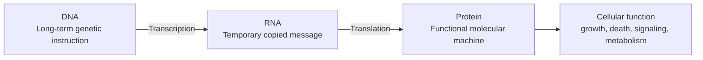

## Simple analogy

Think of a restaurant.

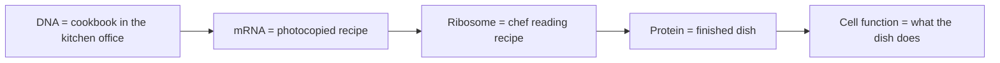

DNA is the master cookbook.
mRNA is a temporary copied recipe.
The ribosome reads the recipe.
The protein is the useful product.

---

# 2. RNA vs mRNA

**RNA** is a broad category. **mRNA** is one type of RNA.

| Term           | Meaning          | Simple explanation                                               |
| -------------- | ---------------- | ---------------------------------------------------------------- |
| RNA            | Ribonucleic acid | A family of molecules involved in gene expression and regulation |
| mRNA           | Messenger RNA    | The RNA copy of a protein-coding gene                            |
| tRNA           | Transfer RNA     | Helps bring amino acids during translation                       |
| rRNA           | Ribosomal RNA    | Structural/catalytic part of ribosomes                           |
| miRNA / lncRNA | Regulatory RNAs  | Often regulate expression without becoming proteins              |

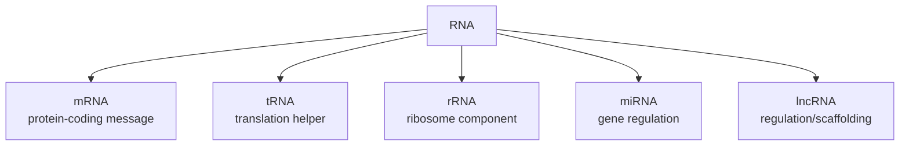

So: **all mRNA is RNA, but not all RNA is mRNA.**

---

# 3. mRNA abundance, protein abundance, enzyme activity

These are three different biological layers.

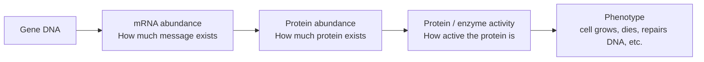

## Definitions

**mRNA abundance**
How much RNA transcript exists for a gene. In RNA-seq, this is often the measured quantity.

**Protein abundance**
How much protein molecule exists. This is usually measured by proteomics, Western blot, mass spectrometry, etc.

**Enzyme activity**
How active the protein is. A protein can be present but inactive.

## Simple analogy

Imagine a factory:

| Biology           | Factory analogy                                |
| ----------------- | ---------------------------------------------- |
| mRNA abundance    | Number of work orders printed                  |
| Protein abundance | Number of machines built                       |
| Enzyme activity   | Whether the machines are turned on and working |
| Phenotype         | How many products the factory makes            |

You can have many work orders but few machines.
You can have many machines but they are switched off.
You can have a machine working faster because it was activated.

---

# 4. Why expression ≠ activity

This is one of the most important concepts for your model.

**Gene expression usually means mRNA level.** But mRNA level does not necessarily tell you whether the protein is active.

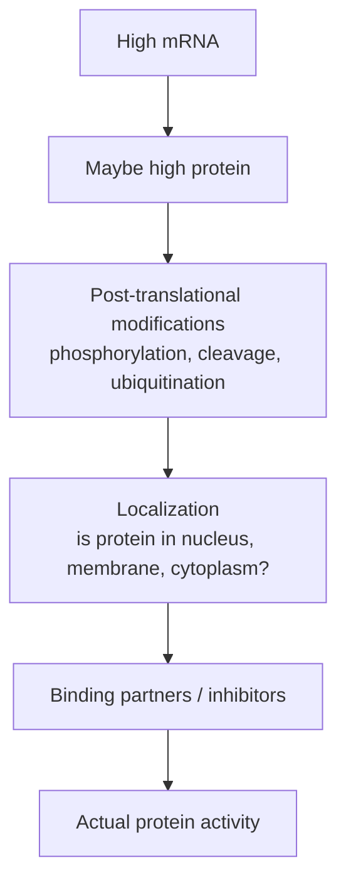

## Reasons expression does not equal activity

1. **Translation efficiency differs**
   Two genes can have the same mRNA level but produce different protein levels.

2. **Protein degradation differs**
   A protein can be rapidly destroyed even if mRNA is high.

3. **Post-translational modification matters**
   Kinases are often controlled by phosphorylation, not by expression.

4. **Localization matters**
   A transcription factor may only work if it enters the nucleus.

5. **Binding/inhibition matters**
   A protein may be present but blocked by another molecule.

## Example

For a kinase like AKT:

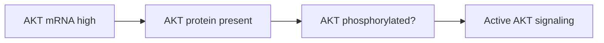

The key activity marker is often **phosphorylated AKT**, not just AKT mRNA.

---

# 5. How drugs are related to genes

Most drugs do **not** directly affect genes. Usually:

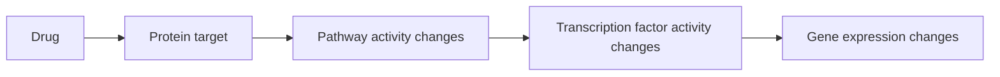

## Better wording

Instead of saying:

> Drug affects gene X.

More precise:

> Drug binds protein target T, changes pathway P, which changes transcription factor activity, which changes expression of gene X.

## Example

A MEK inhibitor:

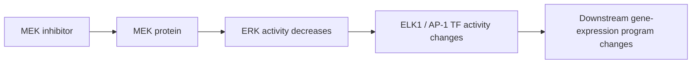

So the drug’s direct target may be **MEK**, but the observed RNA-seq signature may include hundreds or thousands of downstream genes.

---

# 6. Small molecule binding, target proteins, off-targets

## Small molecule

A **small molecule drug** is a chemical compound that can bind to proteins. Many cancer drugs are small molecules.

## Target protein

The **target** is the protein the drug is intended to bind.

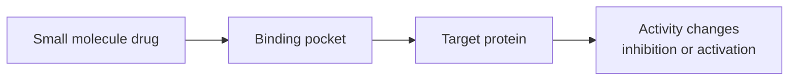

## Off-target effect

An **off-target** is another protein the drug binds unintentionally.

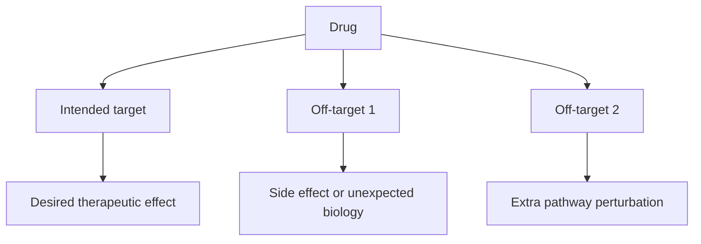

## Why this matters for synergy

If drug A and drug B both hit nearby pathways, they may be synergistic.
If drug A hits the intended target but also an off-target that overlaps with drug B, synergy may come from the off-target biology.

---

# 7. IC50 and EC50

## IC50

**IC50** = concentration where a drug inhibits a biological activity by 50%.

Example: “How much drug is needed to reduce kinase activity by half?”

## EC50

**EC50** = concentration where a drug produces 50% of its maximal effect.

Example: “How much agonist is needed to activate a receptor halfway to its maximum?”

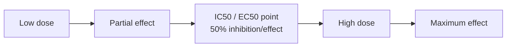

## Difference

| Metric | Usually used for     | Meaning                        |
| ------ | -------------------- | ------------------------------ |
| IC50   | Inhibitors           | Dose causing 50% inhibition    |
| EC50   | Activators/effectors | Dose causing 50% of max effect |

For synergy prediction, potency matters: a drug with strong target binding at low concentration may produce stronger biological perturbation than a weak compound.

---

# 8. Mechanism of action

**Mechanism of action**, or MoA, means how the drug produces its biological effect.

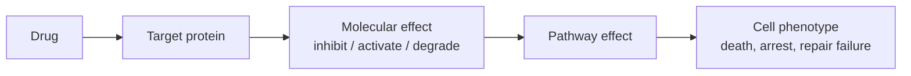

## Example MoAs

| Drug type            | Target/action                | Biological result              |
| -------------------- | ---------------------------- | ------------------------------ |
| Kinase inhibitor     | Blocks kinase activity       | Signaling decreases            |
| Proteasome inhibitor | Blocks protein degradation   | Protein stress increases       |
| PARP inhibitor       | Blocks DNA repair            | DNA damage accumulates         |
| HDAC inhibitor       | Changes chromatin regulation | Gene-expression programs shift |

---

# 9. Signaling pathway master flow

A common pathway structure:

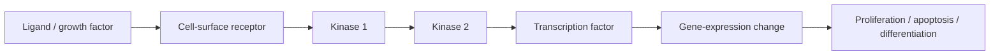

## Simple analogy

A company receives an external email.

| Biology              | Company analogy                      |
| -------------------- | ------------------------------------ |
| Ligand               | External email                       |
| Receptor             | Reception desk                       |
| Kinase cascade       | Managers forwarding instructions     |
| Transcription factor | Executive who changes company policy |
| Gene expression      | Employees receive new instructions   |
| Phenotype            | Company behavior changes             |

---

# 10. Major signaling pathways

## 10.1 MAPK pathway

MAPK is commonly involved in growth and proliferation.

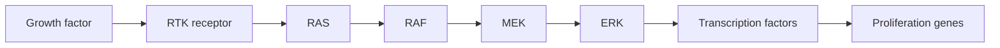

Drug examples: EGFR inhibitors, BRAF inhibitors, MEK inhibitors, ERK inhibitors.

ML relevance: MAPK activity may be more informative than expression of one MAPK gene.

---

## 10.2 PI3K / AKT pathway

PI3K/AKT is involved in survival, growth, metabolism, and resistance.

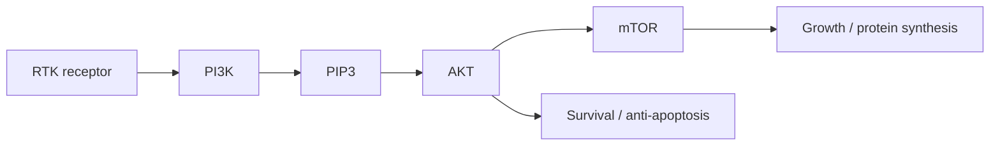

Drug examples: PI3K inhibitors, AKT inhibitors, mTOR inhibitors.

Synergy intuition: PI3K/AKT inhibition can sensitize cells to apoptosis-inducing drugs.

---

## 10.3 JAK / STAT pathway

JAK/STAT converts cytokine signals into transcriptional programs.

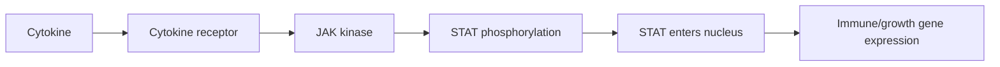

Drug examples: JAK inhibitors.

---

## 10.4 p53 pathway

p53 is a stress-response and tumor-suppressor pathway.

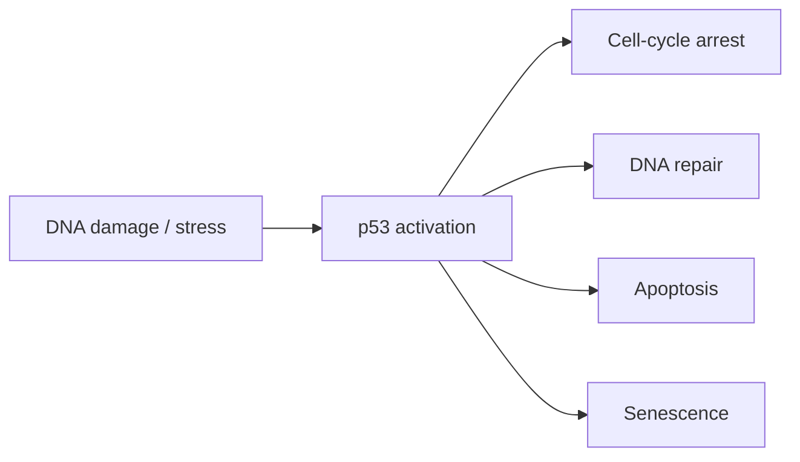

Important: p53 mutation status changes drug response. A DNA-damaging drug may work differently in p53 wild-type vs p53-mutant cells.

---

## 10.5 NF-kB pathway

NF-kB is involved in inflammation, survival, immune signaling, and stress responses.

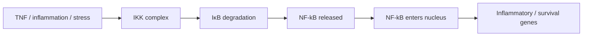

---

## 10.6 Cell cycle

Cell cycle controls whether a cell divides.

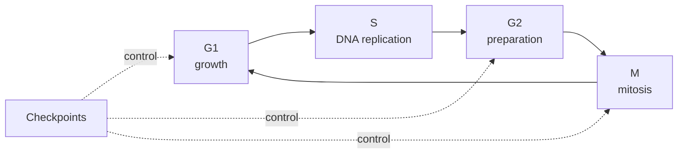

Drug examples: CDK inhibitors, antimitotic drugs.

---

## 10.7 Apoptosis

Apoptosis is programmed cell death.

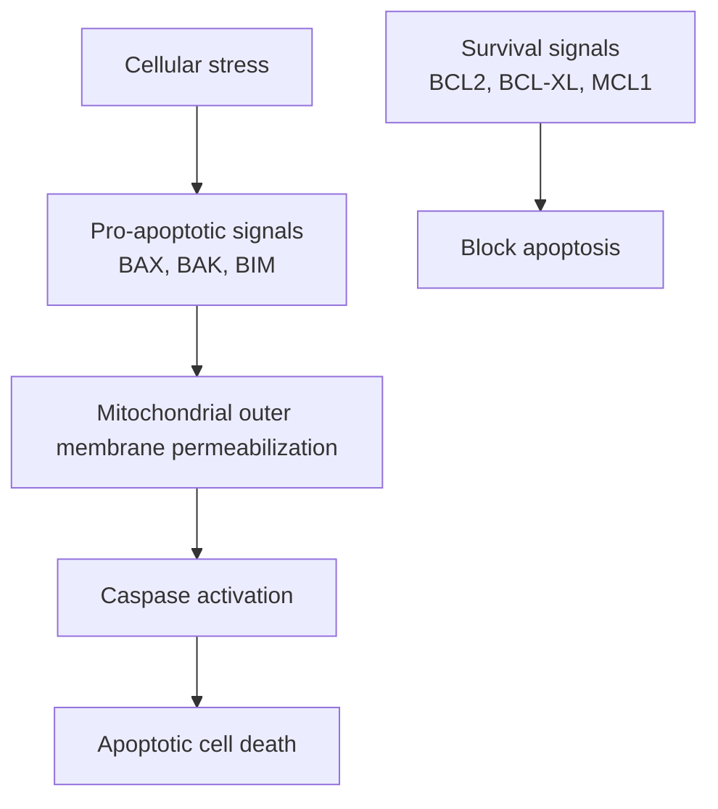

Drug examples: BCL2 inhibitors, chemotherapy, targeted therapies that induce apoptotic priming.

---

## 10.8 DNA damage response

DNA damage response detects DNA lesions and coordinates repair, arrest, or death.

```mermaid
flowchart LR
    Damage["DNA damage"] --> Sensors["ATM / ATR sensors"]
    Sensors --> Checkpoint["CHK1 / CHK2 checkpoints"]
    Checkpoint --> Arrest["Cell-cycle arrest"]
    Checkpoint --> Repair["DNA repair"]
    Repair --> Survival["Survival if repaired"]
    Arrest --> Apoptosis["Apoptosis if damage severe"]
```

Drug examples: PARP inhibitors, ATR inhibitors, CHK1 inhibitors, DNA-damaging chemotherapy.

---

# 11. Transcription factors and regulons

This is directly relevant to your encoder.

## Transcription factor

A **transcription factor**, or TF, is a protein that binds DNA and regulates gene transcription.

```mermaid
flowchart LR
    Signal["Pathway signal"] --> TF["Transcription factor"]
    TF --> DNA["Binds regulatory DNA"]
    DNA --> TargetGenes["Changes target-gene expression"]
```

## TF-target gene

A **TF-target gene relationship** means:

> TF A regulates gene B.

Example:

```mermaid
flowchart LR
    p53["p53 TF"] --> CDKN1A["CDKN1A / p21"]
    p53 --> BAX["BAX"]
    p53 --> MDM2["MDM2"]
```

## Regulon

A **regulon** is the set of genes regulated by a TF.

```mermaid
flowchart TD
    TF["TF: p53"] --> G1["Target gene 1"]
    TF --> G2["Target gene 2"]
    TF --> G3["Target gene 3"]
    TF --> G4["Target gene 4"]
    TF --> G5["Target gene 5"]
```

DoRothEA defines regulons as collections of TF-target interactions and includes signed regulation, meaning activation or repression evidence. ([saezlab.github.io][2])

## Activation vs repression

```mermaid
flowchart LR
    TF1["Activator TF"] -->|increases| GeneA["Target gene expression"]
    TF2["Repressor TF"] -->|decreases| GeneB["Target gene expression"]
```

## TF activity inference

Important: TF mRNA expression is often not enough. You infer TF activity by looking at its target genes.

```mermaid
flowchart LR
    ExpressionData["Gene-expression data"] --> Regulon["Known TF regulon"]
    Regulon --> Pattern["Are activated targets up?<br/>Are repressed targets down?"]
    Pattern --> TFActivity["Inferred TF activity score"]
```

VIPER infers TF/protein activity from expression changes in downstream regulon genes, using prior knowledge of regulatory relationships and their mode of regulation. ([Nature][3])

## Simple analogy

You do not know whether the CEO is active by checking whether the CEO exists in the building.
You infer CEO activity by checking whether the employees changed their behavior.

| Biology          | Company analogy              |
| ---------------- | ---------------------------- |
| TF               | CEO                          |
| Target genes     | Employees                    |
| TF activity      | CEO giving orders            |
| Regulon activity | Pattern of employee behavior |

---

# 12. How pathway perturbation becomes gene-expression change

This is the key conceptual chain:

```mermaid
flowchart LR
    Drug["Drug"] --> Target["Protein target"]
    Target --> Pathway["Pathway activity"]
    Pathway --> TF["TF activity"]
    TF --> Regulon["Regulon target genes"]
    Regulon --> RNAseq["Observed gene-expression signature"]
```

So if your model sees basal expression or perturbation expression, it is seeing the **output layer** of many upstream processes.

---

# 13. Pathway databases vs interaction databases

Do not treat all biological databases as the same. They encode different edge types.

Reactome is a curated, peer-reviewed pathway database for visualizing and analyzing pathway knowledge. ([reactome.org][4]) STRING integrates protein-protein associations, including physical and functional associations, from multiple evidence sources. ([OUP Academic][5]) ChEMBL is a manually curated database of bioactive molecules with drug-like properties, linking chemical, bioactivity, and genomic data. ([ebi.ac.uk][6]) DGIdb is designed for drug-gene interaction search. ([dgidb.org][7])

| Database type                   | Examples                | What the edge means                                                   |
| ------------------------------- | ----------------------- | --------------------------------------------------------------------- |
| Pathways/reactions              | KEGG, Reactome          | A participates in biological pathway/reaction with B                  |
| Protein interaction/association | STRING, BioGRID         | Protein A interacts with or is functionally associated with protein B |
| TF regulation                   | DoRothEA, TRRUST, ChEA  | TF A regulates gene B                                                 |
| Drug-target                     | DrugBank, ChEMBL, DGIdb | Drug X binds/modulates target Y                                       |
| Perturbation signatures         | LINCS/L1000, CMap, CTD  | Drug X changes expression of genes after treatment                    |

## Visual comparison

```mermaid
flowchart TD
    DrugDB["Drug-target DB<br/>DrugBank / ChEMBL / DGIdb"] --> Edge1["Drug → protein"]
    PathwayDB["Pathway DB<br/>KEGG / Reactome"] --> Edge2["Protein/pathway reaction structure"]
    PPIDB["PPI DB<br/>STRING / BioGRID"] --> Edge3["Protein ↔ protein association"]
    TFDB["TF regulation DB<br/>DoRothEA / TRRUST / ChEA"] --> Edge4["TF → target gene"]
    PerturbDB["Perturbation DB<br/>LINCS / L1000 / CMap"] --> Edge5["Drug → expression signature"]
```

## Common mistake

Bad:

```mermaid
flowchart LR
    Drug["Drug"] --> STRING["STRING network"] --> Gene["Gene"]
```

This is too vague. STRING does not directly tell you “drug affects gene.”

Better:

```mermaid
flowchart LR
    Drug["Drug"] --> TargetDB["Drug-target DB"]
    TargetDB --> ProteinTarget["Protein target"]
    ProteinTarget --> STRING["PPI/pathway expansion"]
    STRING --> PathwayScore["Pathway/regulon score"]
    PathwayScore --> GeneSignature["Predicted or observed gene-expression change"]
```

---

# 14. Gene set enrichment and pathway activity scoring

Your raw expression vector may have ~20k genes. That is high-dimensional and hard to interpret.

So we convert:

```mermaid
flowchart LR
    Genes["23k gene-expression vector"] --> GeneSets["Known gene sets / pathways / regulons"]
    GeneSets --> Scores["Pathway or regulon activity scores"]
    Scores --> Model["ML model"]
```

## Why this matters

Instead of feeding the model:

```text
TP53, CDKN1A, BAX, MDM2, CASP3, MAPK1, MAPK3, AKT1, ...
```

You can feed:

```text
p53 activity score
MAPK activity score
PI3K/AKT activity score
apoptosis score
DNA damage response score
cell-cycle score
```

This gives biological structure and can reduce noise.

---

## 14.1 GSEA

**GSEA** asks:

> Are genes from a pathway concentrated near the top or bottom of a ranked gene list?

```mermaid
flowchart LR
    RankedGenes["Genes ranked by differential expression"] --> GeneSet["Pathway gene set"]
    GeneSet --> Enrichment["Enrichment score"]
    Enrichment --> Interpretation["Pathway up/down in condition"]
```

Example:

If apoptosis genes are mostly upregulated after a drug, GSEA may say apoptosis is enriched.

---

## 14.2 ssGSEA

**ssGSEA** is single-sample GSEA.

Instead of comparing two groups, it gives each sample a score for each gene set.

```mermaid
flowchart LR
    Sample1["One cell-line sample"] --> Expression["Expression profile"]
    Expression --> ssGSEA["ssGSEA"]
    ssGSEA --> Scores["One score per pathway"]
```

Useful for your project because each cell line can get pathway scores.

---

## 14.3 GSVA

GSVA estimates variation in pathway activity over samples in an unsupervised way. The original GSVA paper describes it as estimating variation of pathway activity over a sample population. ([PMC][8])

```mermaid
flowchart LR
    ExpressionMatrix["Samples × genes"] --> GSVA["GSVA"]
    GSVA --> PathwayMatrix["Samples × pathways"]
```

For ML:

```text
Before:
cell_line_vector = 23,000 genes

After:
cell_line_vector = 200–2,000 pathway/gene-set scores
```

---

## 14.4 PROGENy

PROGENy infers pathway activity from genes that respond to pathway perturbations. Its documentation describes it as using perturbation experiments to create pathway-responsive gene signatures for pathway activity inference. ([saezlab.github.io][9])

```mermaid
flowchart LR
    RNAseq["Gene expression"] --> PROGENy["PROGENy model"]
    PROGENy --> Pathways["Pathway activity scores<br/>MAPK, PI3K, NF-kB, p53, etc."]
```

Why PROGENy is especially relevant: it is closer to “pathway footprint” than simply checking whether pathway member genes are expressed.

Example:

A MAPK pathway gene may not change expression, but MAPK activity may still change the expression of downstream responsive genes. PROGENy tries to capture that footprint.

---

## 14.5 VIPER

VIPER infers protein/TF activity from downstream target gene expression. It is useful when the protein activity is not visible directly from the protein’s own mRNA level. ([Nature][3])

```mermaid
flowchart LR
    Expression["Gene expression"] --> Regulon["TF regulon"]
    Regulon --> VIPER["VIPER"]
    VIPER --> TFActivity["TF activity score"]
```

For your model:

```text
Input: expression of genes
Output: inferred activity of TFs/proteins
Use as: interpretable cell-line or drug-response features
```

---

# 15. Pathway activity score vs regulon activity score

| Score type             | Input                               | Output                         | Meaning                     |
| ---------------------- | ----------------------------------- | ------------------------------ | --------------------------- |
| Pathway activity score | Gene expression + pathway signature | Activity of pathway            | “MAPK is high”              |
| Regulon activity score | Gene expression + TF-target set     | Activity of TF                 | “MYC is active”             |
| Gene-set score         | Gene expression + gene set          | Enrichment/activity-like score | “Cell-cycle genes are high” |

```mermaid
flowchart TD
    Expr["Gene expression"] --> PathwaySet["Pathway gene set"]
    Expr --> RegulonSet["TF regulon"]
    Expr --> GenericSet["Generic gene set"]

    PathwaySet --> PathwayScore["Pathway activity score"]
    RegulonSet --> RegulonScore["Regulon / TF activity score"]
    GenericSet --> GeneSetScore["Gene-set enrichment score"]
```

---

# 16. Network biology

Network biology treats biological systems as graphs.

```mermaid
flowchart LR
    A["Protein A"] --- B["Protein B"]
    B --- C["Protein C"]
    C --- D["Protein D"]
    A --- E["Protein E"]
```

## Nodes and edges

| Concept | Meaning                                                        |
| ------- | -------------------------------------------------------------- |
| Node    | Biological entity: gene, protein, drug, pathway                |
| Edge    | Relationship: binds, regulates, interacts, activates, inhibits |

## Directed vs undirected graphs

Directed:

```mermaid
flowchart LR
    TF["TF"] --> Gene["Target gene"]
```

Means direction matters: TF regulates gene.

Undirected:

```mermaid
flowchart LR
    ProteinA["Protein A"] --- ProteinB["Protein B"]
```

Means association/interactions without clear direction.

---

## PPI networks

A PPI network connects proteins that physically interact or are functionally associated.

```mermaid
flowchart TD
    DrugTarget["Drug target"] --- P1["Neighbor protein 1"]
    DrugTarget --- P2["Neighbor protein 2"]
    DrugTarget --- P3["Neighbor protein 3"]
    P1 --- P4["Second-order neighbor"]
    P2 --- P5["Second-order neighbor"]
```

STRING is often used here, but remember: STRING edges can be direct physical interactions or functional associations, depending on evidence type. ([OUP Academic][5])

---

## Graph neighborhood

A target’s neighborhood is the set of nearby nodes.

```mermaid
flowchart LR
    Target["Target"] --> N1["1-hop neighbor"]
    Target --> N2["1-hop neighbor"]
    N1 --> N3["2-hop neighbor"]
    N2 --> N4["2-hop neighbor"]
```

For drug features:

```text
Drug target = MEK
1-hop neighborhood = ERK, RAF, scaffold proteins, pathway partners
Pathway neighborhood = MAPK signaling module
```

---

## Network propagation

Network propagation spreads signal from starting nodes through a network.

```mermaid
flowchart LR
    Start["Drug targets<br/>initial heat"] --> Neighbor1["Nearby proteins<br/>high heat"]
    Neighbor1 --> Neighbor2["Farther proteins<br/>lower heat"]
    Neighbor2 --> Background["Rest of network<br/>low/no heat"]
```

Simple analogy: drop ink in water. The proteins near the target get darker; distant proteins get weaker signal.

---

## Random walk with restart

A random walker starts at drug targets. At each step, it either moves to neighbors or jumps back to the targets.

```mermaid
flowchart TD
    Start["Start at drug targets"] --> Move["Move to neighbor protein"]
    Move --> Continue["Continue walking"]
    Continue --> Restart["Restart at target with probability r"]
    Restart --> Start
```

This creates a smooth score over the network:

```text
High score = close/functionally connected to drug target
Low score = far from drug target
```

---

## Network proximity

Network proximity asks:

> Are two sets of proteins close to each other in the network?

For synergy:

```mermaid
flowchart LR
    DrugA["Drug A targets"] --- Distance["Network distance / proximity"]
    DrugB["Drug B targets"] --- Distance
    Distance --> SynergyHypothesis["Close or complementary modules may imply interaction"]
```

Possible interpretations:

| Relationship                  | Synergy intuition                   |
| ----------------------------- | ----------------------------------- |
| Same target                   | May be redundant, not synergistic   |
| Same pathway, different nodes | Possible synergy or additive effect |
| Parallel survival pathways    | Often good synergy candidate        |
| Completely unrelated          | Less obvious synergy                |

---

## Module detection

A module is a cluster of connected proteins.

```mermaid
flowchart TD
    subgraph Module1["MAPK module"]
        A1["RAS"] --- A2["RAF"]
        A2 --- A3["MEK"]
        A3 --- A4["ERK"]
    end

    subgraph Module2["DNA repair module"]
        B1["PARP"] --- B2["BRCA1"]
        B2 --- B3["RAD51"]
    end
```

For synergy, you may ask whether drug pairs hit the same module, adjacent modules, or compensatory modules.

---

# 17. Perturbational transcriptomics

Perturbational transcriptomics asks:

> What happens to gene expression after we perturb the cell?

Perturbation can be:

```mermaid
flowchart TD
    Perturbation["Perturbation"] --> Drug["Drug treatment"]
    Perturbation --> KO["Gene knockout"]
    Perturbation --> KD["Gene knockdown"]
    Perturbation --> OE["Gene overexpression"]
```

## LINCS L1000 / Connectivity Map

LINCS L1000/CMap profiles gene-expression changes after perturbations such as drugs, knockdowns, and overexpression across cell lines. The L1000 Connectivity Map resource describes profiling expression changes after pharmacologic and genetic perturbations, and GEO describes the Broad LINCS project as building a Connectivity Map to discover functional connections between drugs, genes, and diseases via shared expression patterns. ([maayanlab.cloud][10])

```mermaid
flowchart LR
    Drug["Drug treatment"] --> CellLine["Specific cell line"]
    CellLine --> Conditions["Dose + time"]
    Conditions --> L1000["L1000 expression assay"]
    L1000 --> Signature["Drug perturbation signature<br/>up genes + down genes"]
```

## Drug perturbation signature

A drug signature usually contains:

```text
Genes upregulated after treatment
Genes downregulated after treatment
Effect size / z-score / differential expression statistic
Metadata: drug, dose, time, cell line
```

Example:

```mermaid
flowchart LR
    DrugX["Drug X"] --> Up["Upregulated genes<br/>A, B, C"]
    DrugX --> Down["Downregulated genes<br/>D, E, F"]
```

## Why this is directly relevant

Your question is essentially:

> How does drug biology become gene-expression change?

LINCS/L1000 directly measures:

```mermaid
flowchart LR
    Drug["Drug"] --> ExpressionChange["Observed expression change"]
```

This is more direct than trying to infer drug-gene effects only from KEGG or STRING.

---

# 18. Dose, time, and cell-line dependence

Drug effects are not universal.

```mermaid
flowchart TD
    Drug["Same drug"] --> DoseLow["Low dose"]
    Drug --> DoseHigh["High dose"]
    Drug --> TimeShort["Short time"]
    Drug --> TimeLong["Long time"]
    Drug --> CellA["Cell line A"]
    Drug --> CellB["Cell line B"]

    DoseLow --> Sig1["Weak/different signature"]
    DoseHigh --> Sig2["Strong/toxic signature"]
    TimeShort --> Sig3["Immediate signaling response"]
    TimeLong --> Sig4["Secondary transcriptional response"]
    CellA --> Sig5["Context-specific response"]
    CellB --> Sig6["Different mutation/expression context"]
```

For synergy prediction, this matters a lot. The same drug pair can be synergistic in one cell line and not in another.

---

# 19. Recommended mental model: three biological layers

Use this model:

```mermaid
flowchart TD
    subgraph L1["Layer 1: Drug-target"]
        D["Drug"] --> T["Protein target"]
    end

    subgraph L2["Layer 2: Network/pathway propagation"]
        T --> P["Pathway / PPI neighborhood / signaling cascade"]
    end

    subgraph L3["Layer 3: Transcriptional response"]
        P --> TF["Transcription factors"]
        TF --> G["Gene-expression changes"]
    end

    G --> Phenotype["Cell phenotype / synergy response"]
```

## Interpretation

| Layer   | Data type           | Example                    |
| ------- | ------------------- | -------------------------- |
| Layer 1 | Drug-target         | DrugBank, ChEMBL, DGIdb    |
| Layer 2 | Pathway/network     | KEGG, Reactome, STRING     |
| Layer 3 | Expression response | LINCS/L1000, CMap, RNA-seq |

---

# 20. Practical architecture implication for your synergy model

Your current model:

```mermaid
flowchart LR
    DrugA["Drug A hashed SMILES"] --> Concat["Concatenate"]
    DrugB["Drug B hashed SMILES"] --> Concat
    Cell["Cell-line expression/PCA"] --> Concat
    Concat --> MLP["MLP"]
    MLP --> Synergy["Synergy_ZIP prediction"]
```

This is a reasonable baseline, but it has weak biological inductive bias. A hashed SMILES representation does not know targets, pathways, or perturbation signatures.

---

## Better next direction

Do **not** rely only on KEGG/STRING to infer drug-gene effects.

Better pipeline:

```mermaid
flowchart TD
    Drug["Drug"] --> Targets["Known targets<br/>DrugBank / ChEMBL / DGIdb / CTD"]
    Targets --> Proteins["Map targets to genes/proteins"]
    Proteins --> Network["Expand through STRING / Reactome / KEGG"]
    Network --> Programs["Convert to pathway/regulon scores"]
    Drug --> LINCS["LINCS/L1000 perturbation signature<br/>if available"]
    Programs --> Features["Drug-context features"]
    LINCS --> Features
    Cell["Cell-line basal expression / pathway state"] --> Features
    Features --> Model["Synergy prediction model"]
```

---

# 21. Recommended feature families

## Drug-level features

| Feature                         | Why useful                       |
| ------------------------------- | -------------------------------- |
| SMILES embedding/fingerprint    | Chemical structure               |
| Known targets                   | Direct biology                   |
| Target pathway memberships      | Mechanism-level information      |
| Network-expanded target profile | Captures nearby affected biology |
| LINCS perturbation signature    | Direct observed drug effect      |
| Drug-induced pathway scores     | Compressed, interpretable effect |

## Cell-line features

| Feature                    | Why useful                     |
| -------------------------- | ------------------------------ |
| Basal gene expression      | Cell state before treatment    |
| Mutation/CNV if available  | Context for pathway dependency |
| Pathway activity scores    | Biological programs            |
| TF/regulon activity scores | Regulatory state               |
| Tissue/cancer type         | Prior biological context       |

## Pair-level features

| Feature                          | Why useful                             |
| -------------------------------- | -------------------------------------- |
| Target overlap                   | Redundancy or shared mechanism         |
| Pathway overlap                  | Shared pathway effect                  |
| Network proximity                | Whether targets are biologically close |
| Complementary pathway hits       | Potential synergy                      |
| Opposing perturbation signatures | Possible rescue/reversal effects       |
| Similar perturbation signatures  | Similar MoA or redundancy              |

---

# 22. Example: drug pair feature construction

Suppose:

```text
Drug A = MEK inhibitor
Drug B = PI3K inhibitor
Cell line = KRAS-mutant cancer cell line
```

Biology:

```mermaid
flowchart LR
    KRAS["KRAS mutation"] --> MAPK["MAPK pathway high"]
    KRAS --> PI3K["PI3K/AKT survival pathway"]

    DrugA["MEK inhibitor"] --> MAPK
    DrugB["PI3K inhibitor"] --> PI3K

    MAPK --> Growth["Growth/proliferation"]
    PI3K --> Survival["Survival/anti-apoptosis"]

    Growth --> Synergy["Potential synergy"]
    Survival --> Synergy
```

ML features:

```text
Drug A target: MEK
Drug B target: PI3K/AKT/mTOR axis
Cell-line state: KRAS mutant, high MAPK activity
Pair feature: parallel growth + survival pathway blockade
Expected: possible synergy
```

---

# 23. How to convert 23k genes into model-ready biological programs

```mermaid
flowchart LR
    Expr["Raw expression<br/>~23k genes"] --> Normalize["Normalize / batch correct"]
    Normalize --> Scores1["GSVA / ssGSEA<br/>gene-set scores"]
    Normalize --> Scores2["PROGENy<br/>pathway activity"]
    Normalize --> Scores3["VIPER + DoRothEA<br/>TF activity"]
    Scores1 --> ModelInput["Compact biological feature vector"]
    Scores2 --> ModelInput
    Scores3 --> ModelInput
```

Example output:

```text
Cell line vector:
MAPK_activity = 1.8
PI3K_activity = 1.2
p53_activity = -0.7
NFkB_activity = 0.5
MYC_activity = 2.1
apoptosis_score = -0.3
cell_cycle_score = 2.4
DNA_damage_response_score = 0.9
```

This is easier for a model to learn from than thousands of raw genes.

---

# 24. Recommended architecture options

## Option A — Strong tabular baseline

Best immediate next step.

```mermaid
flowchart LR
    DrugAFeatures["Drug A features<br/>SMILES + targets + pathways + LINCS"] --> PairEncoder["Pair feature builder"]
    DrugBFeatures["Drug B features<br/>SMILES + targets + pathways + LINCS"] --> PairEncoder
    CellFeatures["Cell-line features<br/>expression + pathway + TF scores"] --> PairEncoder
    PairEncoder --> MLP["MLP / TabTransformer / FT-Transformer"]
    MLP --> Synergy["Synergy score"]
```

Use this first because it is simple, ablatable, and interpretable.

---

## Option B — Multimodal encoder

Better if you have enough data.

```mermaid
flowchart TD
    DrugA_SMILES["Drug A SMILES"] --> ChemEncoderA["Chemical encoder"]
    DrugB_SMILES["Drug B SMILES"] --> ChemEncoderB["Chemical encoder"]

    DrugA_Bio["Drug A target/pathway/LINCS"] --> BioEncoderA["Biology encoder"]
    DrugB_Bio["Drug B target/pathway/LINCS"] --> BioEncoderB["Biology encoder"]

    Cell["Cell-line expression/pathway/TF"] --> CellEncoder["Cell encoder"]

    ChemEncoderA --> Fusion["Fusion"]
    ChemEncoderB --> Fusion
    BioEncoderA --> Fusion
    BioEncoderB --> Fusion
    CellEncoder --> Fusion

    Fusion --> Predictor["Synergy predictor"]
```

---

## Option C — Graph-aware drug biology model

Useful later, after you establish strong tabular baselines.

```mermaid
flowchart TD
    DrugTargets["Drug targets"] --> Graph["Biological graph<br/>STRING / Reactome / TF regulation"]
    Graph --> Propagation["Network propagation / GNN"]
    Propagation --> DrugBioEmbedding["Drug biological embedding"]
    DrugBioEmbedding --> SynergyModel["Synergy model"]
```

Do not start here unless your data pipeline is already clean. Graph models are powerful but easy to make noisy.

---

# 25. Suggested ablation experiments

This is how you prove whether the biology helps.

```mermaid
flowchart TD
    M0["Model 0<br/>Current DeepSynergy-style baseline"] --> Compare["Compare performance"]
    M1["Model 1<br/>+ known drug targets"] --> Compare
    M2["Model 2<br/>+ pathway scores"] --> Compare
    M3["Model 3<br/>+ TF/regulon scores"] --> Compare
    M4["Model 4<br/>+ LINCS signatures"] --> Compare
    M5["Model 5<br/>+ network propagation"] --> Compare
```

Recommended metrics:

```text
Regression:
- RMSE
- MAE
- Pearson correlation
- Spearman correlation

Ranking/classification:
- AUROC for synergistic vs non-synergistic
- AUPRC if labels are imbalanced

Generalization splits:
- random split
- leave-drug-out
- leave-cell-line-out
- leave-drug-pair-out
```

The most important split is not random split. For real scientific value, test whether the model generalizes to unseen drugs or unseen cell lines.

---

# 26. Your practical research direction

For each drug:

```mermaid
flowchart TD
    Step1["1. Get known targets<br/>DrugBank / ChEMBL / DGIdb / CTD"]
    Step2["2. Map targets to genes/proteins"]
    Step3["3. Expand targets<br/>STRING / Reactome / KEGG"]
    Step4["4. Convert neighborhoods to pathway/regulon scores"]
    Step5["5. Compare with LINCS/L1000 signatures"]
    Step6["6. Feed features into synergy model"]
    Step7["7. Use scores for interpretation"]

    Step1 --> Step2 --> Step3 --> Step4 --> Step5 --> Step6 --> Step7
```

## Best next-step architecture

Use a **biology-augmented tabular/multimodal MLP baseline** before jumping to GNNs.

Concrete version:

```mermaid
flowchart LR
    A1["Drug A hashed SMILES"] --> AEnc["Drug A encoder"]
    A2["Drug A target/pathway/LINCS features"] --> AEnc

    B1["Drug B hashed SMILES"] --> BEnc["Drug B encoder"]
    B2["Drug B target/pathway/LINCS features"] --> BEnc

    C1["Cell-line basal expression PCA"] --> CEnc["Cell encoder"]
    C2["Cell-line pathway/TF scores"] --> CEnc

    AEnc --> Fusion["Symmetric fusion<br/>A+B, A*B, |A-B|"]
    BEnc --> Fusion
    CEnc --> Fusion

    Fusion --> MLP["Prediction head"]
    MLP --> ZIP["Synergy_ZIP"]
```

Use symmetric pair features so the model respects that:

```text
Drug A + Drug B = Drug B + Drug A
```

Recommended fusion:

```text
pair = [
  drugA_embedding + drugB_embedding,
  abs(drugA_embedding - drugB_embedding),
  drugA_embedding * drugB_embedding,
  cell_embedding,
  drugA_cell_interaction,
  drugB_cell_interaction
]
```

---

# 27. Final mental model

The whole field can be compressed into this:

```mermaid
flowchart TD
    Drug["Drug"] --> Target["Protein target"]
    Target --> Activity["Protein activity changes"]
    Activity --> Pathway["Pathway signaling changes"]
    Pathway --> TF["Transcription factor activity changes"]
    TF --> Expression["Gene-expression changes"]
    Expression --> Phenotype["Cell phenotype"]
    Phenotype --> Synergy["Drug-combination synergy"]

    CellContext["Cell-line context<br/>mutations, basal expression, pathway state"] --> Activity
    CellContext --> Expression
    CellContext --> Phenotype
```

Your model should not think of drugs as just SMILES strings and cells as just raw expression vectors.

The better representation is:

```text
drug chemical structure
+ drug target biology
+ pathway/network propagation
+ drug-induced transcriptomic signature
+ cell-line basal state
→ synergy prediction
```

That is the right biological framing for the next stage of your project.

[1]: https://www.ncbi.nlm.nih.gov/books/NBK540152/?utm_source=chatgpt.com "Biochemistry, Replication and Transcription - StatPearls - NCBI"
[2]: https://saezlab.github.io/dorothea/?utm_source=chatgpt.com "Collection Of Human And Mouse TF Regulons • dorothea"
[3]: https://www.nature.com/articles/s41540-024-00386-w?utm_source=chatgpt.com "Flexible modeling of regulatory networks improves ..."
[4]: https://reactome.org/?utm_source=chatgpt.com "Reactome Pathway Database: Home"
[5]: https://academic.oup.com/nar/article/51/D1/D638/6825349?utm_source=chatgpt.com "STRING database in 2023: protein–protein association ..."
[6]: https://www.ebi.ac.uk/chembl/?utm_source=chatgpt.com "ChEMBL"
[7]: https://dgidb.org/?utm_source=chatgpt.com "DGIdb"
[8]: https://pmc.ncbi.nlm.nih.gov/articles/PMC3618321/?utm_source=chatgpt.com "GSVA: gene set variation analysis for microarray and RNA ..."
[9]: https://saezlab.github.io/progeny/?utm_source=chatgpt.com "PROGENy: Pathway RespOnsive GENes for activity ..."
[10]: https://maayanlab.cloud/Harmonizome/resource/LINCS%2BL1000%2BConnectivity%2BMap?utm_source=chatgpt.com "LINCS L1000 Connectivity Map Resource"
