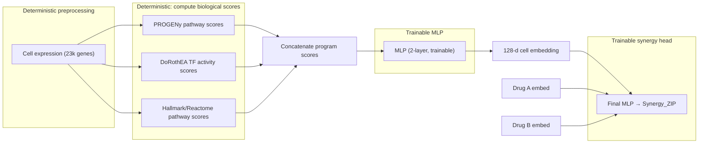
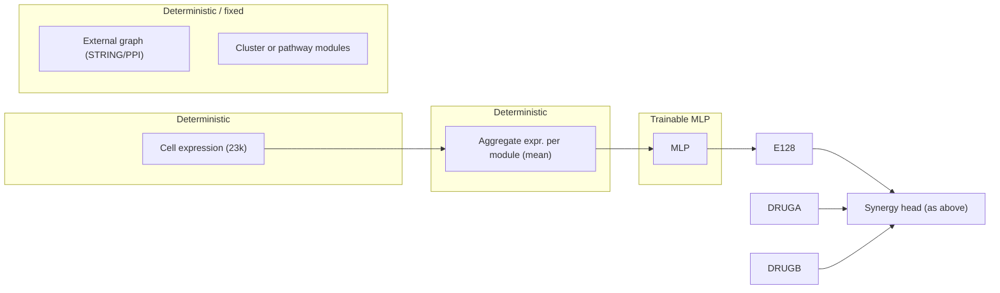
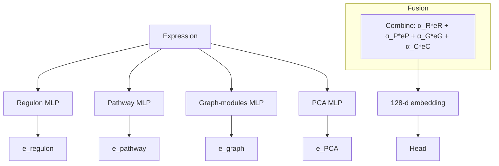
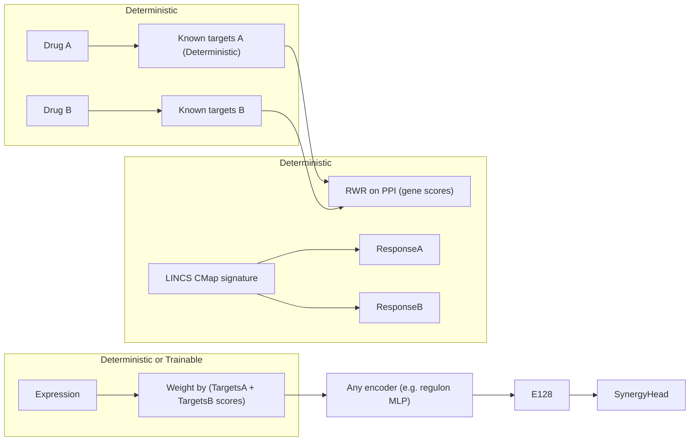
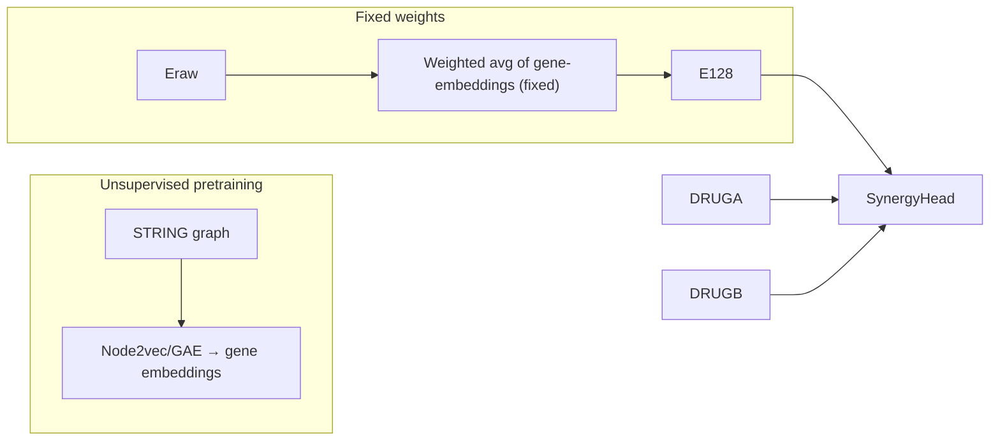
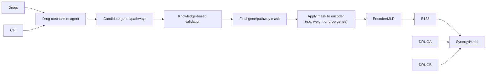

# Part 1 – Comparison of approaches

| **Approach** | **Core architecture** | **Datasets / resources needed** | **Implementation phases (new baselines)** | **Evaluation (splits/metrics)** | **Rating / Pivot** |
|---|---|---|---|---|---|
| **1. Program encoder + MLP** (biological programs) | *Deterministic:* Compute pathway/regulon activity scores from z-scored gene expression. *MLP:* 2-layer supervised MLP → 128-d cell embedding. | DoRothEA/TRRUST TF regulons (signed TF→targets)【11†L23-L32】; PROGENy pathway-responsive genes【8†L88-L91】; MSigDB/Hallmark/Reactome gene sets. (Optional: VIPER) | **P1:** PROGENy only. **P2:** DoRothEA only. **P3:** PRO+TF combined. **P4:** +Hallmark/Reactome. **P5:** +small gene residual (raw/PCA). | Random split, leave-drug-out, leave-cell-out, leave-drug+cell-out (e.g. RMSE, Pearson). | **Highest priority.** Simple, interpretable, minimal risk. If it **fails**, programs may miss synergy signal; pivot to drug-conditioned or perturbation-based models. If it **helps**, refine via occlusion and possibly set-attention on programs.  (C.f. TranSynergy【4†L39-L47】 showed knowledge features can improve synergy.) |
| **2. Graph modules encoder** | *Deterministic:* Map expression onto graph-derived gene modules. *MLP:* Small MLP on module activities → 128-d embedding. | STRING PPI/OmniPath network; KEGG/Reactome pathways; other PPI databases. | **P1:** Use curated pathways (KEGG/Reactome) as modules, aggregate (mean/ssGSEA). **P2:** Cluster STRING graph (Louvain/Leiden) → modules; aggregate expression per cluster. **P3:** Graph-smoothing: propagate expression (e.g. \(X' = \alpha X + (1-\alpha)AX\)). **P4:** Drug-target propagation: random-walk from known targets to weight genes. **P5:** MLP on module vector. | Same splits as above. | **Second priority.** Adds network context without heavy training. If it **fails**, a full GNN is unlikely to do better without more data; pivot to graph pretraining or simpler program model. If it **improves**, one might try a shallow GNN encoder. (TranSynergy used RWR on PPI【4†L39-L47】 to enrich drug profiles.) |
| **3. High-capacity encoder (GNN/Transformer)** | *GNN variant:* Genes as nodes, expression as node features, edges from STRING/KEGG; use 1–2 GNN layers → pool → 128-d. *Transformer variant:* Set-attention over gene or program tokens (no positional enc.), with STRING/OmniPath attention bias. | STRING/OmniPath graphs (edge scores); optionally directed signaling networks; pretraining corpora. | **P1:** Shallow GNN (1–2 layers) with global pooling. **P2:** Graph-biased transformer on genes or on program tokens. **P3:** Attention mask from graph adjacency or pathway membership. **P4:** (If data allows) Masked-token pretraining on external expression compendia. | Same splits. | **Low confidence.** High risk of overfitting given ~59 cell lines (lack large pretrain). If it **fails**, revert to simpler encoders. If it **works**, consider deeper or multitask pretraining. (Note: GNNs like DeepDDS【30†L136-L144】 have boosted performance, but SynVerse warns on overfit【20†L112-L120】.) |
| **4. Mixture-of-priors encoder** | Run multiple encoders in parallel (e.g. regulon-MLP, pathway-MLP, graph-modules, PCA), then **fuse**: \(\alpha_1 e_{\rm regulon} + \alpha_2 e_{\rm pathway} + \alpha_3 e_{\rm graph} + \alpha_4 e_{\rm PCA}\) → 128-d. | All of (1)+(2) plus raw PCA: DoRothEA, PROGENy, STRING graph, plus PCA on top-genes. | **P1:** Regulon-only branch. **P2:** +Pathway branch (concat). **P3:** +Graph-module branch. **P4:** +PCA residual branch. **P5:** Learn or set α weights (e.g. sparse/nonnegative). | Same splits. | **Robust fallback.** Learns which prior helps. If α collapses to PCA, curated priors aren’t informative in this task. If it **fails**, biological priors may not carry synergy signal; pivot to conditional models. If it **works**, analyze which α >>0; try to refine winning branch. |
| **5. Drug-conditioned encoder** | *Deterministic:* Map each drug→targets; compute gene relevance (e.g. network distance or signature effect). *Trainable:* Weight/gate expression by relevance, then encode (e.g. regulon or pathway MLP) → 128-d **specific to (A,B)**. | Drug-target databases (ChEMBL, DrugBank, BindingDB), LINCS/CMap perturbation signatures【34†L34-L43】, STRING/KEGG network for propagation. | **P1:** Static target overlap: weight genes in pathways near known targets. **P2:** Network-proximity: RWR distances from drug-A/B targets over PPI. **P3:** LINCS weighting: genes responsive to each drug. **P4:** Apply weights to expression/program scores → encoder. **P5:** Learn a small gating network per drug-pair (trained on train-fold labels). | Same splits (ensure drug-not-in-train for drug-split scenario!). | **Innovative.** Makes cell embedding context-specific. If it **fails**, target data may be too sparse/noisy; fallback to pure perturbation (next). If it **wins**, drugs’ network context is key. Compare to Perturbation model. |
| **6. Graph-pretrained gene embeddings** | *Pretrain:* Use unsupervised graph ML (node2vec, GAE, contrastive) on STRING/KEGG to get fixed gene embeddings (64–128d). *Cell embedding:* Pool (e.g. weighted avg or attention) of gene embeddings by expression. | Same PPI/STRING/OmniPath graphs, no synergy labels for pretrain. | **P1:** Node2vec or DeepWalk on STRING → gene vectors. **P2:** Graph autoencoder / GraphSAGE on PPI. **P3:** Expression-weighted average or attention pooling to get cell embedding. **P4:** (Optional) Light fine-tuning on train fold only. | Same splits. | **Modular deep option.** Leverages large unlabeled graph. If it **fails**, topology alone doesn’t capture drug context; skip to end-to-end or add expression fine-tune. If it **succeeds**, use more advanced unsupervised GNN (contrastive, clustering). |
| **7. Perturbation & dependency integration** | Augment cell encoding with **drug-response** and **dependency** features. For example, use LINCS drug-signatures and DepMap gene essentiality alongside basal expression programs. | LINCS L1000/CMap signatures【34†L34-L43】; DepMap/CCLE (CRISPR/RNAi dependencies, mutations, CNVs). | **P1:** Append LINCS-derived pathway scores for each drug. **P2:** Append DepMap essentiality scores for each cell. **P3:** Pretrain a monotherapy response encoder (drug→effect on cell lines). **P4:** Multi-task train on monotherapy + synergy labels (split-safe). **P5:** Contrastive alignment between target profile and expression. | Same splits. | **Long-term, high potential.** Directly models drug→gene effects. If it **fails**, data mismatch/coverage is the issue (try imputing missing). If it **improves**, combine with other priors as final fusion. (CMap has been used to link drugs to gene signatures.) |
| **8. LLM / multi-agent feature builder** | Use LLM agents to **propose** relevant genes/pathways for drug pairs, grounded in databases. Output structured masks or weights. Integrate these as extra features or masks on gene programs. | All above + literature APIs (PubMed), but MUST validate via DB (no hallucinations). | **P1:** Retrieval agent: list drug targets, known pathways/mechanisms. **P2:** Validate agent: check each claim in databases (DrugBank, CTD, etc.). **P3:** Feature agent: suggest gene sets/TFs affected by drug combo (with confidences). **P4:** Construct features/masks; feed into main model (e.g. multiply activations). | Same splits (agent outputs must use only train-fold drugs/cells). | **Experimental.** Can surface novel mechanistic hints. If it **fails**, at least it gathered structured domain knowledge; if it **helps**, refine agents. (Ensure all outputs are database-verified to avoid hallucinations.) |

*Key notes:* Evaluation should compare each phase against the baseline (PCA-128 cell encoding) across all splits (random, drug-out, cell-out, combined). SynVerse found that even “biologically meaningful” features often didn’t beat a one-hot baseline【20†L112-L120】, so robust fold-wise validation and shuffling controls are required. The table above ranks **Approach 1** as highest priority (low-risk interpretability), then Graph modules, etc., down to the more speculative LLM agent. We should prepare fallback strategies (pivot) as noted: if the top choice fails, try the next most orthogonal approach.

# Part 2 – Detailed elaboration of each method

### 1. Program encoder + small MLP

**Reasoning:** Compressing genes into known biological programs (pathways, regulons) reduces dimension and adds interpretability【8†L88-L91】【11†L23-L32】. For example, PROGENy infers pathway activities from expression using perturbation-derived gene signatures【8†L88-L91】, and DoRothEA provides curated TF→target sets for inferring transcription factor activities. This approach mirrors TranSynergy’s idea of “modeling cellular effect through gene-gene interaction and gene dependency” in a structured way【4†L39-L47】.

**Flow (mermaid diagram):**  



- **Deterministic blocks:** Compute **PR** (PROGENy) and **TF** (DoRothEA) scores, and any pathway scores. These use only gene expression and fixed weights (no training on synergy data).
- **Trainable blocks:** The MLP encoder and final synergy-prediction MLP are trained end-to-end on synergy labels, fold-wise. Drug embeddings and MLP decoder are as in baseline.
- **Data splits:** For each train/val/test fold, recompute z-scoring and program scores using *only training-cell means/vars*. (Do not leak test statistics.) Use the same random/drug/cell/combined splits as baseline.

**Phases:**  
- *P1 (PROGENy only):* Use PROGENy scores as MLP input. Compare vs PCA baseline.  
- *P2 (DoRothEA only):* Use TF scores (VIPER if desired).  
- *P3 (PRO + TF):* Concatenate PROGENy + TF activities.  
- *P4 (+ Hallmark/Reactome):* Add unsupervised pathway scores (e.g. single-sample GSEA) to cover extra biology.  
- *P5 (+ gene residual):* Add a small branch of top-genes or PCA to capture anything missed by programs.

Each phase’s model is a “new baseline.” We record performance on all splits.

**If fails:** Lack of improvement suggests these program activities are too coarse or orthogonal to synergy signal. We would then pivot to drug-conditioned (method 5) or perturbation methods, meaning perhaps the cell’s generic programs aren’t explaining drug response differences.

**If improves:** We’ll use occlusion analysis (OCA) at the program level: mask one pathway/regulon score and observe Δprediction/Δerror. Also we could try replacing the MLP with an attention-set: treat each program score as a “token” and run a small transformer encoder without positional encoding. This may capture interactions between programs.

**Sources:** PROGENy【8†L88-L91】 and DoRothEA【11†L23-L32】. (Both widely used for activity scoring.) TranSynergy supports knowledge features in synergy【4†L39-L47】.

### 2. Graph-derived module encoder

**Reasoning:** Use biological network structure to define gene modules or smooth signals. For example, aggregate expression by network communities (clusters) or known pathways. This adds context (genes in same pathway behave similarly). Such module-based compression was effective in other domains and avoids training a big GNN.

**Flow:**  



- **Modules:** Could be KEGG/Reactome pathways (predefined sets) or graph clusters from STRING (Louvain).  
- **Graph smoothing variant:** instead of clustering, one can compute \(E' = \alpha E + (1-\alpha) A E\) with adjacency \(A\). Then aggregate or directly feed to MLP.
- **Trainable:** Only MLP. The aggregation and clustering are deterministic.

**Phases:**  
- *P1:* Use curated pathways (each row of KEGG) as modules (sum or ssGSEA) → MLP.  
- *P2:* Cluster the STRING graph into ~100–300 modules (e.g. Leiden) → average expression → MLP.  
- *P3:* Smooth expression on graph (heat diffusion) and use smoothed features directly into MLP.  
- *P4:* Use drug-target propagation weights (RWR from targets) as features (like method 5, but here global).  
- *P5:* Combine modules with MLP.

**If fails:** It suggests that unsupervised graph structure didn’t capture synergy-relevant patterns. A full GNN is unlikely to succeed either without more data【20†L112-L120】. We could try the graph-pretrained embedding (next) as a different way to use the network.

**If succeeds:** We can try a shallow GNN (few layers) fine-tuned on synergy to see if joint learning helps. Possibly also add an attention mechanism to modules. Interpret results by checking which modules (pathways/clusters) have high occlusion impact.

**Sources:** Graph smoothing and clustering are standard. TranSynergy used RWR on PPI【4†L39-L47】, which is akin to smoothing from drug targets.

### 3. Higher-capacity (GNN / Transformer) model

**Reasoning:** Directly apply graph neural nets or attention to the gene network. For example, a GNN that passes messages on the STRING network can learn complex patterns. Or a transformer over gene tokens, but without fixed positions, may capture global relations. However, with ~59 cell lines, this is high-risk without pretraining【20†L112-L120】.

**Flow:**  

```mermaid
flowchart TB
    Eraw["Expression (23k genes)"] --> subgraph GraphGNN
        GNN["GNN Layers (trainable)"] 
    end
    GNN --> Pool["Pool (mean or attn)"]
    Pool --> Emb["128-d embedding"]
    Emb --> SynergyHead
    DRUGA["Drug A"] --> SynergyHead
    DRUGB["Drug B"] --> SynergyHead
    
    click GraphGNN "LABEL: Nodes=genes, edges=STRING, features=exp." "hover text"
```

Or transformer variant: feed each gene’s expression as a token into a set-transformer with a graph-based attention mask, producing a pooled vector.

- **Trainable:** GNN layers or attention weights are trained on synergy.  
- **Pretraining:** Potentially pretrain on large transcriptome data if available.

**Phases:**  
- *P1:* Shallow GNN on STRING (1–2 layers).  
- *P2:* Add graph attention or edge biases (e.g. Transformer with adjacency).  
- *P3:* (Optional) Pretrain masked-genes tasks on a large expression compendium.  
- *P4:* If GNN fails, try set-attention over GO/pathway tokens (smaller token set).

**If fails:** Likely overfits; we would trust earlier simpler methods instead.  
**If improves:** Explore deeper GNN, graph contrastive pretraining, or integrate drug info into attention.

**Sources:** DeepDDS【30†L136-L144】 demonstrated a GNN+attention outperformed classical methods. But SynVerse【20†L112-L120】 warns GNNs often don’t generalize. Use limited layers and weight sharing cautiously.

### 4. Mixture-of-priors encoder

**Reasoning:** Combine multiple biological compressors to hedge bets. Each branch (regulon, pathway, graph, PCA) encodes different aspects. We then learn (or fix) how to weight them. This avoids reliance on any single prior.

**Flow:**  



- Each branch is like a small MLP on different features.  
- **Trainable:** Branch MLPs and optionally mixing weights α_i.  
- **Deterministic:** The inputs to each branch (score computations or PCA).

**Phases:**  
- *P1:* Only Regulon branch.  
- *P2:* + Pathway branch.  
- *P3:* + Graph-modules branch.  
- *P4:* + PCA branch (residual).  
- *P5:* Learn sparse α (e.g. via regularization) vs. fix them equally or to (1,1,1,1).

We can interpret α via occlusion: if α_R ≈0, regulons weren’t useful, etc.

**If fails:** If the mixture falls back to PCA (α_C≈1), it means the curated priors add no synergy signal. In that case, likely more exotic context is needed (drug-conditioned, etc.).  
**If improves:** We learn which prior is most predictive. We could then refine the winning branch further.

**Sources:** This is a meta-architecture. It naturally includes Approach 1 and 2 as subcases. SynVerse’s negative result【20†L112-L120】 suggests all branches might fail, but this approach will confirm that by weights.

### 5. Drug-conditioned encoder

**Reasoning:** Different drug pairs may “activate” different parts of the cell’s biology. We use known drug targets or signatures to focus the cell embedding on relevant genes. For example, if Drug A targets kinases, emphasize kinase-pathway genes in expression.

**Flow:**  



- **Deterministic:** Mapping each drug to known targets; network diffusion (Random Walk) from targets to all genes (yields gene relevance scores)【4†L39-L47】. LINCS: known drug-induced expression patterns.
- **Gate:** Apply relevance scores to gene expression (e.g. multiply or mask). Optionally learn a small gating network (trainable) on top of these.
- **Trainable:** MLP on weighted expression, plus synergy head.

**Phases:**  
- *P1:* Use target overlap: e.g. select genes in pathways containing any target.  
- *P2:* RWR on PPI: genes near targets get high weight.  
- *P3:* LINCS: weight genes by known up/down regulation under each drug.  
- *P4:* Plug weighted expression into regulon/pathway encoder.  
- *P5:* Let a small NN learn to combine drug-scores and expression (fold-wise train, no leakage from held-out drugs).

**If fails:** Perhaps drug-target data is incomplete. Then pure perturbation (LINCS) or MoA descriptors may be better.  
**If improves:** This approach directly tests if context matters. We would analyze which genes/programs get gated. A win here suggests training a full drug-aware graph neural net might be next.

**Sources:** Drug→target networks are common (DrugBank). TranSynergy used RWR to expand targets【4†L39-L47】. LINCS L1000【34†L34-L43】 provides empirical target-response data.

### 6. Graph-pretrained gene embeddings

**Reasoning:** Learn gene embeddings from large biological graphs without synergy labels. For example, run node2vec or a graph autoencoder on STRING to get a vector for each gene that captures network context. Then, for a cell line, combine these embeddings weighted by expression (as in DeepSet). This modularizes the problem and uses vast external data.

**Flow:**  



- **Pretraining:** e.g. Node2Vec, Graph Autoencoder yields gene vectors (static).
- **Pooling:** For each cell: \(e_{\rm cell} = \sum_i \text{exp}_i * \text{emb}_i\). Could also use attention (trainable) on top of gene embeddings.
- **Trainable:** The attention or pooling MLP and synergy head.

**Phases:**  
- *P1:* Node2vec embeddings (64/128d), pool by expression mean.  
- *P2:* Graph autoencoder embeddings, pool.  
- *P3:* (Optional) Pretrain a GNN with contrastive losses.  
- *P4:* Add a small attention MLP to pool embeddings (trainable on train fold only).  
- *P5:* Fine-tune gene embeddings on train folds (cautiously, since few samples).

**If fails:** Likely the structure-based embeddings ignored expression context. We might need to incorporate expression in pretraining (e.g. GraphSAGE).  
**If helps:** We see that network topology provides a good basis, so we can try deeper GNN transfer (fine-tune on synergy).

**Sources:** Graph embedding methods (node2vec) are standard. This is a precaution against end-to-end overfitting. Similar ideas of transferring embeddings have been used in biology (word2vec-like protein embeddings).

### 7. Perturbation and dependency integration

**Reasoning:** Drug synergy arises from drug effects on the cell. Integrating known gene-level perturbation data can inform which genes the drugs might affect. LINCS/CMap【34†L34-L43】 contains thousands of drug-induced gene-expression profiles. DepMap contains CRISPR/RNAi essentiality (gene dependencies) across hundreds of cell lines. Including these as features can enrich the context beyond basal expression.

**Flow:**  

```mermaid
flowchart LR
    Drugs -> LINCS_feat["Map to LINCS signature features"]
    Cells -> DepMap_feat["Map to DepMap dependency features"]
    Eraw["Basal expression"] --> ProgramEncoder["Regulon/Pathway encoder"]
    subgraph Fusion [Combine features]
        ProgramEncoder
        LINCS_feat
        DepMap_feat
    end
    Fusion --> MLPfusion["Fusion MLP"]
    MLPfusion --> E128
    E128 --> SynergyHead
    DRUGA --> SynergyHead
    DRUGB --> SynergyHead
```

- **Deterministic:** Extract features: from each drug, fetch its LINCS vector or project onto pathways; from each cell, take its top dependencies.  
- **Trainable:** The fusion MLP that ingests (cell state embedding, plus these features). Possibly multitask or contrastive loss with these modalities.

**Phases:**  
- *P1:* Augment cell input by appending drug LINCS signature (or summary) to the embedding.  
- *P2:* Add cell-line DepMap gene effect scores as features.  
- *P3:* Pretrain separate monotherapy autoencoder (drug→gene response) on LINCS, freeze into synergy model.  
- *P4:* Multitask train: predict synergy and also reconstruct LINCS/monotherapy response.  
- *P5:* Use contrastive loss: align drug target profile with observed signatures.

**If fails:** Possibly drug signature not aligned to synergy conditions. We may restrict to well-characterized drugs or use only correlation metrics.  
**If improves:** Strong indication that actual drug effects matter; consider full multi-modal net (with drug pathway branch).

**Sources:** LINCS/CMap data enables linking drugs to gene changes【34†L34-L43】. CODE-AE【arxiv:2102.00538】 is a related idea for deconfounded representations, supporting transfer learning in drug response.

### 8. LLM / Multi-agent feature builder

**Reasoning:** Use language models and agents to query the literature/databases for mechanistic insights. For a given (DrugA, DrugB, Cell), agents could propose which genes or pathways are jointly relevant, which then become features or masks in the model. This is not the core predictor but a tool to guide feature design.

**Flow:**  



- **Agent1:** LLM retrieves known drug targets, pathways, side-effects (from databases/text).  
- **Validator:** Check each retrieved fact (e.g. using DrugBank or CTD APIs) to avoid hallucination.  
- **Mask:** A binary or weighted mask on genes (e.g. “genes likely affected by A or B” or “TFs regulating those genes”).  
- **Integration:** Multiply the mask with expression or program scores before passing to MLP.

**Phases:**  
- *P1:* Simple retrieval: list DrugA/B targets & shared pathways.  
- *P2:* Agent builds hypotheses (e.g. “DrugA activates TF X”). Validate or discard.  
- *P3:* Form a final feature vector (e.g. indicator of each top pathway/regulon).  
- *P4:* Train synergy model with these extra features. (Agents are not trained here.)

**If fails:** The agents may not add useful signal or may hallucinate. In that case, revert to purely data-driven priors.  
**If helps:** The masked genes or features should highlight new biology. We could then automate more iterations (agent suggests features → model evaluates importance via OCA → agent refines).

**Sources:** No specific references (this is an experimental idea). Similar multi-agent frameworks exist (e.g. ARC-AGI), but emphasis is on database grounding.

# Part 3 – Other ideas not fully developed

- **Raw-gene transformer (no positional encoding):** Treat each gene as a token with no fixed order. Too many tokens (23k) and few samples make this high-risk without massive pretraining (cf. Geneformer requiring millions of cells). Likely infeasible directly.  
- **End-to-end cell GNN:** Directly feed full graph GNN. Probably overfits (SynVerse found GNNs struggled) unless huge regularization or transfer-learning is used.  
- **Contrastive/self-supervised transcriptome models:** E.g. train a VAE/A​E on CCLE/NCI-60 data to embed expression, then fine-tune. Could be tried but risk learning batch effects.  
- **Chemical graph encoder upgrades:** Upgrade drug branch (not central to gene compression), e.g. pretrain MolGNet or ChemBERTa. This may help overall but doesn’t address gene dimension.  
- **Focused subset training:** Train separate models on only high-synergy (or only low-synergy) examples to highlight extreme interactions, then distill into main model. Risk of bias if not handled carefully.  
- **Random pathway controls:** Use random gene sets of same sizes as Hallmark for negative controls, to ensure any signal is not random. (Not a stand-alone method but essential validation.)  
- **Mixture-of-experts with gating:** Instead of fixed α, a gating network (conditioned on drug features) that selects which encoder to trust. More complex, similar in spirit to drug-conditioned gating above.  
- **Batch correction / domain adaptation:** Models to adjust for dataset shifts (NCI-60 unique distribution vs others). Could include adversarial or normalization layers. Unlikely to fix the main dimension issue.  

**Sources (cont’d):** Additional insights from related work: SynVerse【20†L112-L120】 emphasizes caution, and recent embedding studies【23†L171-L180】 show how learned embeddings can capture similarity in scarce data. Use all prior knowledge carefully and validate thoroughly.